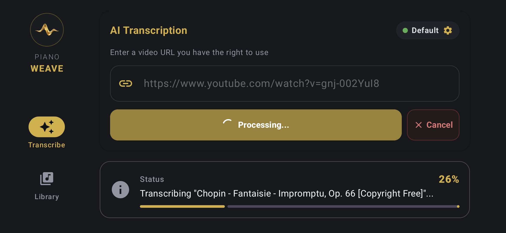
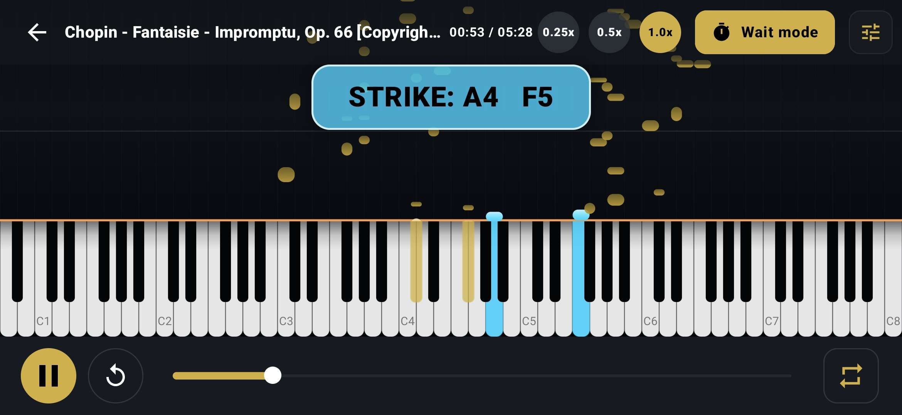

  

<h1 align="center">Piano Weave</h1>

  <b>Upgrade your piano learning experience with high-fidelity practice tools.</b> 
  Piano Weave transcribes piano performances from online videos into interactive practice sessions with an ultra-pro piano roll and a high-quality Grand Piano audio engine.

  <a href="#-features">Features</a> •
  <a href="#-community--support">Community & Support</a> •
  <a href="#-screenshots">Screenshots</a> •
  <a href="#%EF%B8%8F-setup">Setup</a> •
  <a href="#-key-modules">Key Modules</a> •
  <a href="#license">License</a>

---

## 📱 Screenshots

|                                            AI Transcription                                           |                                          Piano Roll & Wait Mode                                          |
| :---------------------------------------------------------------------------------------------------: | :------------------------------------------------------------------------------------------------------: |
|  |  |

## ✨ Features

* **AI Transcription:** Uses a FastAPI backend to transcribe piano performances from online video URLs (e.g. YouTube) into MIDI data.
* **Ultra-Pro Piano Roll:** Practice with a high-fidelity interactive roll featuring A/B looping, speed control, and transposition.
* **Grand Piano Sound:** Powered by FluidSynth and high-quality SoundFonts for a rich, realistic acoustic piano experience.
* **Adaptive UI:** Optimized for both landscape (tablet/practice mode) and portrait (browsing mode) orientations.
* **MIDI Integration:** Support for hardware MIDI input (USB/Bluetooth) and touch-simulated piano keys.
* **Wait Mode:** Acoustic note detection that pauses playback until you strike the correct notes.

## 💬 Community & Support

  
  
  

## 🛠️ Setup

### Transcription server

This app requires the [Piano Transcription Server](https://github.com/Virtover/piano-transcription-server) running locally or on a server.

### Configuration

1. Copy `app/src/main/assets/config/config.example.txt` to `app/src/main/assets/config/config.txt`.
2. Set your `DEFAULT_API_BASE_URL` in the config file (e.g., `http://10.0.2.2:8000/` for a local emulator).

### Build

Open the project in Android Studio and build the `:app` module.

## 🚀 Key Modules

* **`audio`:** Real-time FluidSynth integration for grand piano synthesis.
* **`midi`:** Binary MIDI parsing and hardware input management.
* **`api`:** Retrofit-based communication with the transcription backend.
* **`ui`:** Modern Jetpack Compose implementation of the practicing dashboard.

## License

Piano Weave is licensed under the [PolyForm Noncommercial License](LICENSE).

Copyright (c) 2026 Krzysztof Olszak

The software may be used, modified, and distributed for noncommercial purposes subject to the terms of the license.

Commercial use is not permitted without prior permission from the copyright holder. For the full terms, see the LICENSE file.
